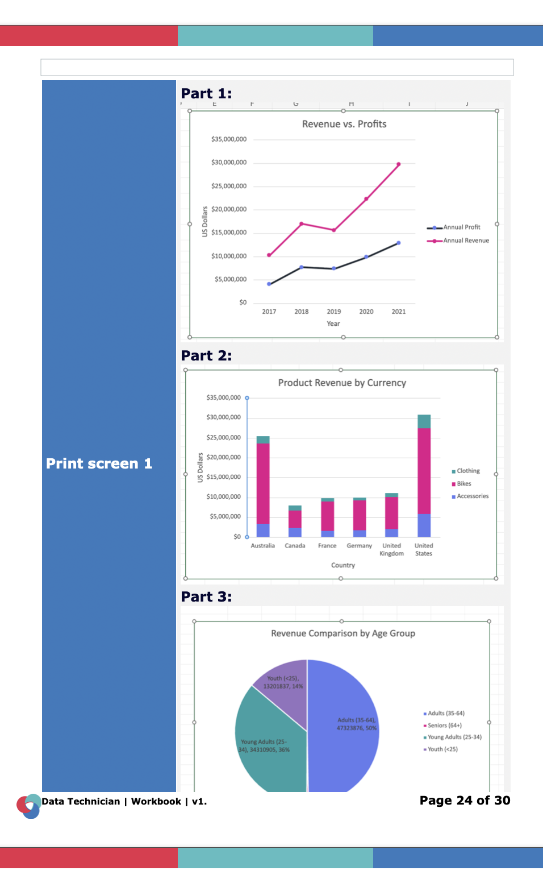
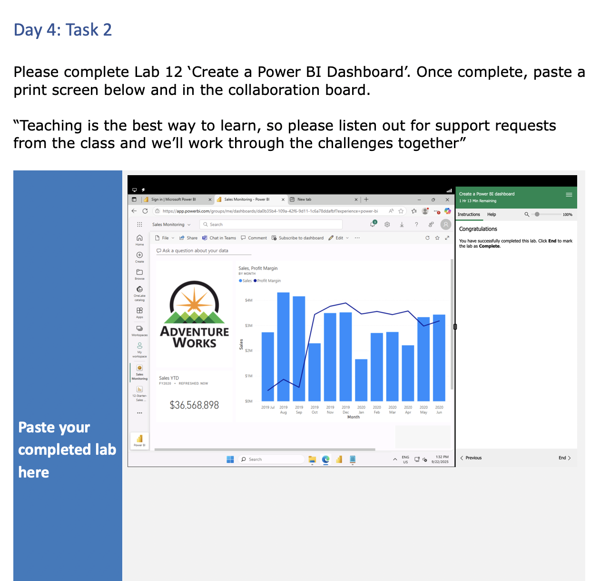
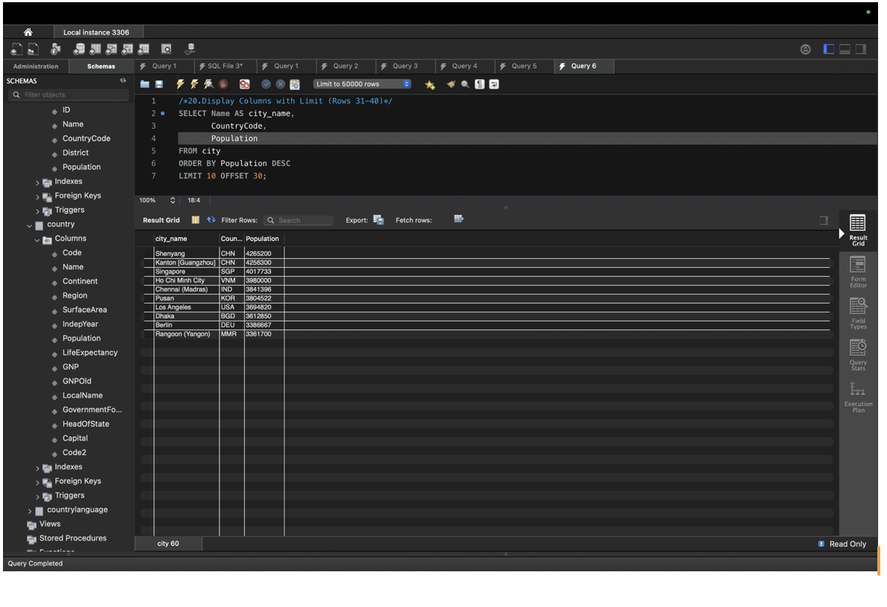
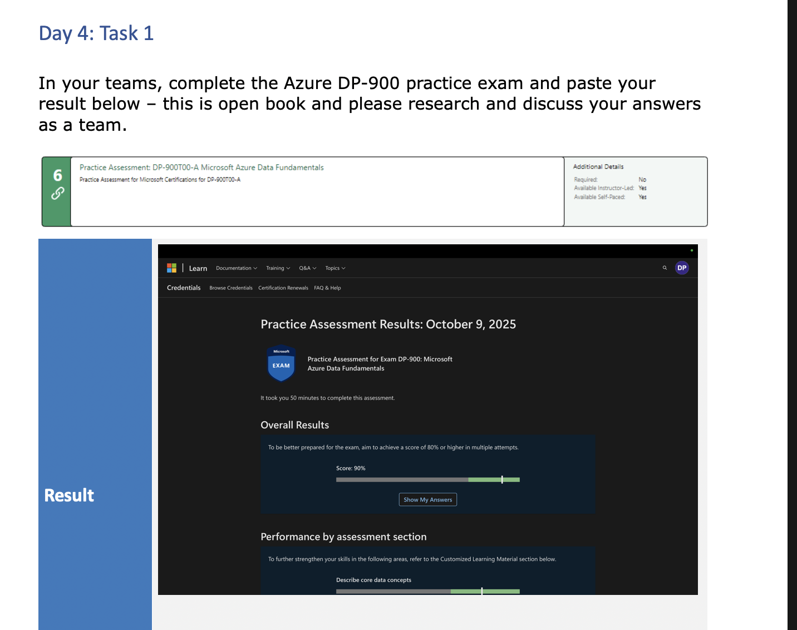
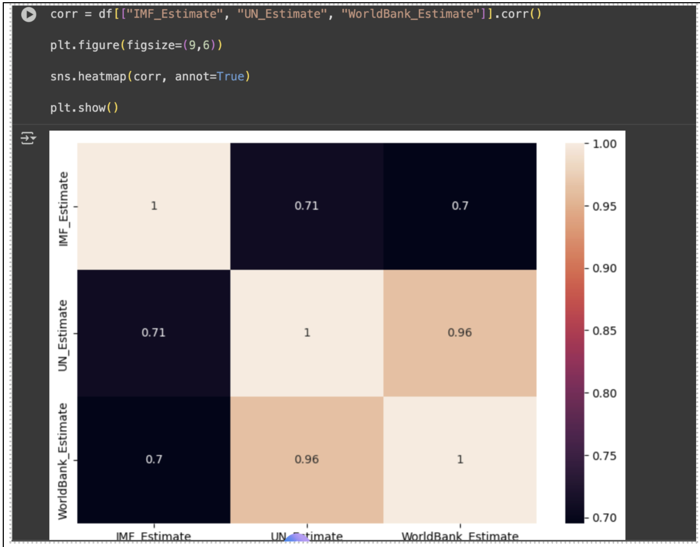

# 📊 Data Bootcamp Portfolio — Weekly Assessments  
**Author:** Devika Njattuvetty Pradeep  

Welcome to my **Data Analysis Bootcamp Portfolio**.  
This repository includes all my weekly assessments and evidence of work completed during the program — from Excel and data visualization to SQL, Azure, and beyond.

Each week’s submission includes:  
- A `.docx` file containing my completed work.  
- A `.png` screenshot showing proof of completion.

---

## 🗓️ Week 1 — Introduction to Data & Excel  

**Topics Covered:**  
- Core data concepts & types  
- Importance of data in decision-making  
- Data lifecycle management  
- Excel fundamentals

**Learning Objectives & Activities:**  
- Understand **common rules, laws, and regulations** when working with customer data.  
- Analyze **retail sales datasets** from Kaggle.  
- Work with multiple datasets:  
  - Airline flights dataset (Kaggle)  
  - Bike sales dataset (pivot table lab)  
- Visualize data using **Excel** for reporting.  
- Practice **bike sales visualization lab**. 

**Evidence:**  
  
[📄 Download Week 1 Report](week1.docx)

---

## 🗓️ Week 2 — Excel, Tableau & Power BI  

**Topics Covered:**  
- Navigation & features of Tableau and Power BI  
- Importing and connecting to datasets  
- Visualizing and analyzing data

**Learning Objectives & Activities:**  
- Research **different Tableau versions** and their features.  
- Use the **emsi_jobchange_uk_dataset** to create dashboards and analyses in Tableau.  
- Power BI hands-on labs:  
  - **Lab 1:** Get data in Power BI Desktop  
  - **Lab 2:** Load and transform data  
  - **Lab 8:** Design a report  
  - **Lab 12:** Create a Power BI dashboard  

**Evidence:**  
  
[📄 Download Week 2 Report](week2.docx)

---

## 🗓️ Week 3 — Database Design & SQL  

**Topics Covered:**  
- Database structuring and normalization  
- SQL fundamentals  
- CRUD operations

**Learning Objectives & Activities:**  
- Learned **SQL** and relational database concepts.  
- Completed a **500-word essay** explaining steps to set up a database for a small retail business:  
  - Understanding business requirements  
  - Designing the database schema  
  - Planning tables, relationships, and queries  
- Participated in **group activity** to practice SQL operations. 

**Evidence:**  
  
[📄 Download Week 3 Report](week3.docx)

---

## 🗓️ Week 5 — Azure Fundamentals & Job Search  

**Topics Covered:**  
- Microsoft Azure data fundamentals  
- GDPR, DPA 2018, and data compliance  
- Data security and cloud storage

**Learning Objectives & Activities:**  
- Learned **cloud computing concepts**
- Explored **Microsoft Azure**: relational and non-relational data storage, analytics, and data pipelines.  
- Completed hands-on labs:  
  - **Lab:** Explore relational data in Azure  
  - **Lab:** Explore non-relational data in Azure  
  - **Lab:** Explore data analytics in Azure (DP-900 T00)  

**Evidence:**  
  
[📄 Download Week 5 Report](week5.docx)

## 🗓️ Week 6 — Python (will be adding soon) 

**Topics covered:**  
- Python programming fundamentals  
- Data manipulation using **Pandas** and **NumPy**  
- Data visualization using **Matplotlib** and **Seaborn**  

**Evidence:**  
  
[📄 Download Week 6 Report](week6.docx)

---

## 🧠 Skills and Tools Covered Across Bootcamp  

- **Data Analysis & Reporting:** Excel (pivot tables, charts, dashboards, formulas)  
- **Programming & Querying:** Python (Pandas, NumPy, Matplotlib, Seaborn), SQL  
- **Data Visualization:** Power BI, Tableau, Excel dashboards  
- **Database Management:** Relational & non-relational databases, Azure Fundamentals  
- **Cloud Computing:** Microsoft Azure, cloud data storage and processing  
- **Other Tools:** GitHub, Jupyter Notebook  

---

## 🧠 Notes  

- All `.docx` reports and images are stored directly in this folder.  
- Each file corresponds to the week of study (e.g., `week1.docx`, `image1.png`).  
- This portfolio tracks my learning progress across the entire Data Bootcamp — from **Excel basics** to **Azure analytics**.

---

✨ *Created and maintained by **Devika Njattuvetty Pradeep** as part of the Data Bootcamp learning journey.*

